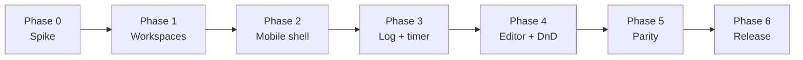

# Lift Tracker — Web + Mobile Build Plan

_As of 2026-09-22._ Companion to [BUILD_PLAN.md](BUILD_PLAN.md), which covers the web PWA. This
document covers the move to a `web` / `mobile` / shared monorepo and the native mobile app.

**How to use this document:** same rule as BUILD_PLAN.md. Hand Claude one phase at a time. Each
phase leaves web deployable and the root gates green.

---

## 0. Decisions made (2026-09-22)

- [x] **Option B**: monorepo with `web`, `mobile` and shared packages. Web stays the Vite PWA.
      Mobile is a new Expo app with a native UI. No Capacitor detour.
- [x] **Firebase SDK on mobile**: decided after the Phase 0 spike.
- [x] **Package manager**: pnpm workspaces.
- [x] **First release**: iOS and Android together. React Native carries nearly everything; expect a
      couple of small native implementations behind the platform adapter.
- [x] **Web → store hand-off**: not a redirect. The web app cannot tell whether the native app is
      installed, and React Native cannot answer that for a web page either. Use what the OS provides:
  - iOS Safari: the `apple-itunes-app` meta tag shows the Smart App Banner. Safari knows whether the
    app is installed and shows "Open" or "View".
  - Android Chrome: `related_applications` with the Play package id and
    `prefer_related_applications: true` in the web manifest. Chrome then offers the native app
    instead of installing the PWA.
  - Share links: universal links (iOS) and app links (Android) open the app when installed and fall
    back to the web page when not. Nothing in the page has to check.

---

## 1. Where the app stands today

The repo is already split the way a shared-code project needs. About 13,200 lines of pure
TypeScript sit in `src/domain/` with no React and no Firebase imports. That code moves to mobile
as-is. The UI (`src/features/`, ~14,300 lines, plus `src/app/`, ~1,400 lines) is written against
Mantine in 66 files. That code does not move to mobile.

| Layer                                                                  | Lines         | Depends on                         | Portable to React Native?     |
| ---------------------------------------------------------------------- | ------------- | ---------------------------------- | ----------------------------- |
| `src/domain/` (overlay, strength, volume, diff, sharing, tests)        | ~13,200       | nothing                            | Yes, unchanged                |
| `src/catalog/` (bundled exercise data + search index)                  | ~400 + JSON   | nothing                            | Yes, unchanged                |
| `src/data/` (Firebase converters, hooks, mutations)                    | ~3,800        | Firebase JS SDK, React             | Mostly, behind a small adapter |
| `src/features/` (screens)                                              | ~14,300       | Mantine, dnd-kit, CSS modules      | No, rewrite per screen        |
| `src/app/` (router, PWA shell, service worker)                         | ~1,400        | Vite PWA, Workbox, react-router    | No, web only                  |

The web app already has a rest timer, a service-worker notification and dnd-kit reordering. The
limits are the browser's, not the code's:

- **Rest timer and clock.** iOS suspends a backgrounded tab's JavaScript. The service worker in
  `src/sw.ts` is a best-effort workaround, and it only fires if the PWA is installed.
- **Notifications.** iOS delivers web push only to an installed PWA. Sticky, repeating and
  action-button behavior is inconsistent across browsers.
- **Drag and drop.** dnd-kit fights the browser's scroll and long-press gestures on touch. There is
  no haptic feedback and no native reorder animation.

Everything else (offline logging, overlays, sharing, PR tracking, schedule) works today and must
keep working on web through the change.

---

## 2. The options compared

| | A. Port everything to React Native (Expo + react-native-web) | B. Monorepo: web / mobile / shared | C. Wrap the PWA with Capacitor |
| --- | --- | --- | --- |
| Web app | Rewritten in RN primitives, served through react-native-web | Untouched; current Vite PWA keeps shipping | Untouched |
| Mobile app | Native iOS/Android from the same code | New Expo app, native UI | Current web UI inside a native shell |
| Code reused | `domain`, `catalog`, most of `data` | `domain`, `catalog`, most of `data` | 100% |
| Code thrown away | All ~15,700 lines of Mantine UI and PWA shell | None | None |
| Code written | One new UI (all screens, once) | One new UI (all screens, once) | Plugin glue: timer, notifications, haptics |
| Rest timer / notifications | Native | Native | Native (background task + local notification plugins) |
| Drag and drop | Native gesture handler on mobile; same on web, feels less web-like | Native on mobile, dnd-kit stays on web | Still dnd-kit in a WebView; no improvement |
| Web performance | Worse. react-native-web ships a large runtime; Mantine, CSS modules, Workbox and the Lighthouse budgets go away | Same as today | Same as today |
| Look and feel | One UI on both. Web looks like a mobile app | Two UIs. Each matches its platform | One UI, web-styled |
| Store presence | Yes | Yes | Yes, but Apple can reject thin WebView apps |
| Ongoing cost | One codebase, one UI | Two UIs to keep in step; shared logic changes once | Lowest |
| Rough effort | Largest: rebuild web and mobile at once | Large: build mobile only | Smallest: days to a couple of weeks |

Option A does not save the UI work. Mantine has no React Native version, so every screen is
rewritten either way. Option A also makes you rewrite and re-tune the web app you already have, and
accept a slower one.

Option C solves timer, clock and notifications but not drag and drop, and adds an App Store review
risk. Rejected on 2026-09-22 in favor of going straight to B.

---

## 3. Recommendation (adopted)

Option B: a monorepo with `web`, `mobile` and shared packages. Keep the PWA as the web app. Build
the mobile app in Expo.

1. **The UI rewrite is the same size under A and B.** Option A adds a web rewrite and a slower web
   app on top. Speed is the stated top priority for this app.
2. **The shared code already exists.** The BUILD_PLAN ground rules kept `domain` pure and Firebase
   confined to `data`. Option B is mostly moving folders, not refactoring.
3. **Different UIs is a feature here.** A gym app on a phone wants big touch targets, swipe
   gestures, haptics and a lock-screen timer. A web app wants keyboard entry and dense tables for
   reviewing history.
4. **Nothing breaks while you build.** Web keeps deploying from day one. The mobile app can ship at
   30% parity (log a workout, rest timer) and still be useful.

Two UIs cost something: every new feature needs two screens. Keep that cost down by putting all
logic, all state shape and all Firestore access in shared packages, so a screen is only layout plus
calls into shared hooks.

---

## 4. Target architecture

pnpm workspaces. pnpm's strict, non-hoisted `node_modules` catches a screen that imports something
its package never declared, which is the main way two UIs drift. Metro needs `node-linker=hoisted`
in `.npmrc` (or Expo's documented pnpm setup) because it does not follow pnpm symlinks well. Vite is
fine either way.

```
lift-tracker/
  apps/
    web/          # current src/app + src/features + sw.ts, Vite, Mantine, Playwright
    mobile/       # Expo app: expo-router, RN screens
  packages/
    domain/       # src/domain as-is. Pure TS, no deps. Vitest
    catalog/      # src/catalog as-is. JSON + search index
    data/         # converters, hooks, mutations, sync. Firebase + React only
    ui-tokens/    # colors, spacing, type scale as plain TS, consumed by Mantine theme and RN styles
  firebase.json, firestore.rules, rules/, scripts/   # stay at the root
```

| Package | Contents | Platform code allowed | Notes |
| --- | --- | --- | --- |
| `domain` | types, overlay, strength, volume, workoutDiff, sharing, schedule, history, export | None | Moves unchanged. Keep the no-React, no-Firebase lint rule |
| `catalog` | generated JSON, `index.ts`, refinements | None | `scripts/build-catalog.ts` writes here |
| `data` | converters, mutations, hooks, sync state, auth hook | Firebase JS SDK, React | Firestore access stays confined here for both apps |
| `data` adapters | `platform.ts` interface: `persistence`, `now()`, `scheduleAlarm()`, `cancelAlarm()`, `haptic()` | Web impl in `apps/web`, native impl in `apps/mobile` | Small. Only for things the browser and phone do differently |
| `apps/web` | everything under `src/app` and `src/features`, `sw.ts`, `index.html`, Vite config, e2e | Web | Imports from `@lift/domain`, `@lift/data`. No behavior change |
| `apps/mobile` | Expo screens, navigation, native timer, notifications, drag and drop | React Native | Imports the same packages |

Rules that keep the two UIs cheap:

- A screen never touches Firestore. It calls hooks from `@lift/data`.
- A screen never computes overlay, volume, PR or unit math. It calls `@lift/domain`.
- New feature work starts in `domain` and `data` with tests, then gets a web screen and a mobile
  screen.
- Shared hooks own `useRestCountdown`-style logic. The `platform` adapter owns how the deadline
  survives the app going to background.

**Firebase in React Native needs one decision.** The Firebase JS SDK runs in Expo, so `@lift/data`
reuses directly. But its Firestore offline cache on React Native is memory only, so queued writes
are lost if the OS kills the app mid-gym. `@react-native-firebase/firestore` uses the native SDKs
with full disk persistence, and its modular API now mirrors the JS SDK closely. Spike this in
Phase 0 before committing.

---

## 5. Phased build plan

Each phase leaves web deployable and `pnpm typecheck && pnpm lint && pnpm test && pnpm build`
green at the root.



### Phase 0: Spike (1–2 evenings)

Prove the two unknowns before moving anything.

- [ ] `npx create-expo-app` in a scratch folder. Copy `src/domain` in. Run its vitest suite under
      the RN TypeScript config.
- [ ] Sign in with the existing Firebase project. Read one workout with the Firebase JS SDK. Repeat
      with `@react-native-firebase`.
- [ ] Kill the app with a pending offline write. Relaunch. Check which SDK kept the write.
- [ ] Schedule a local notification 90 s out, background the app, lock the phone. Confirm it fires
      on a real iPhone and a real Android phone.

**Exit:** a written choice of Firebase SDK and a yes/no on background notifications.

### Phase 1: Workspaces, no behavior change

- [ ] Switch to pnpm: `pnpm-workspace.yaml`, `.npmrc` with `node-linker=hoisted`, delete
      `package-lock.json`. Create `apps/web`, `packages/domain`, `packages/catalog`,
      `packages/data`, `packages/ui-tokens`.
- [ ] `git mv` folders. Fix imports to `@lift/domain` etc. Keep `tsconfig` project references; each
      package gets its own `tsconfig.json` and `package.json` with `exports`.
- [ ] Move Vite, PWA, Playwright, Lighthouse and bundle-size configs under `apps/web`. Root scripts
      delegate with `pnpm --filter web run <script>`.
- [ ] Move theme colors and spacing into `ui-tokens`; Mantine theme reads from it.
- [ ] Add a lint rule: `packages/domain` and `packages/catalog` may not import `react`, `firebase`
      or `@mantine/*`.
- [ ] Update `.github/workflows/*` paths. Firebase Hosting deploys `apps/web/dist`.

**Exit:** production deploy has the same feature set. Lighthouse and bundle budgets unchanged.

### Phase 2: Mobile shell

- [ ] `apps/mobile` with Expo SDK, `expo-router`, TypeScript strict, same ESLint base.
- [ ] Metro config for workspace packages. Confirm `@lift/domain` and `@lift/catalog` import and
      tree-shake.
- [ ] Auth (sign in, email verification, sign out) using the `@lift/data` auth hook plus the Phase 0
      SDK choice.
- [ ] Read-only screens: Today, Workouts list, Workout detail. Bottom tabs matching `BottomNav.tsx`.
- [ ] Sync strip / offline indicator from `useSyncState`.

**Exit:** you can open the app at the gym and see today's workout offline.

### Phase 3: Logging, rest timer, notifications

The reason for the project.

- [ ] Active session screen: set grid, overlay numbers, RIR, unit toggle, all from shared hooks.
- [ ] Rest timer: shared `useRestCountdown` plus native `platform.scheduleAlarm`. Deadline stored as
      a timestamp, never a running interval.
- [ ] Local notification at deadline with Done action and repeat. Haptic and optional chime in the
      foreground.
- [ ] Keep-awake toggle while a session is active.
- [ ] Bodyweight entry and PR flag on save.

**Exit:** full workout logged offline on a phone, timer fires with the screen locked, session syncs
when back online. Web unchanged.

### Phase 4: Workout editor and drag and drop

- [ ] Editor screen: slots, prescription editor, exercise picker with catalog search and recent
      searches.
- [ ] Reorder with `react-native-reanimated` + `react-native-gesture-handler` (via
      `react-native-draggable-flatlist` or `react-native-sortables`). Long-press to lift, haptic on
      pick and drop.
- [ ] Swipe to delete or duplicate, matching `SwipeRow` behavior.
- [ ] Version history view from `workoutDiff`.

**Exit:** create and edit a workout on the phone; web sees the new version.

### Phase 5: Parity

- [ ] History timeline, session detail, trend line, calendar.
- [ ] Sharing: universal links / app links so share URLs open the app; import and merge through the
      shared importer.
- [ ] Schedule, library browse, friends and QR, settings, export.
- [ ] Muscle map: port `bodyPolygons` to `react-native-svg`.

**Exit:** every scenario in `e2e/*.spec.ts` has a mobile equivalent (Maestro or Detox).

### Phase 6: Release

- [ ] EAS Build. TestFlight and Play internal testing.
- [ ] Store listing, privacy labels, account deletion flow (already exists in
      `mutations/account.ts`).
- [ ] Point phone visitors at the store with the OS mechanisms (Smart App Banner,
      `related_applications`, universal/app links). See §0.

---

## 6. How each missing feature gets built on mobile

| Feature | Web today | Mobile approach | Shared piece |
| --- | --- | --- | --- |
| Rest timer that survives background | `useRestCountdown` in the page, `sw.ts` holds the deadline as a fallback | Store `deadlineAt` (epoch ms) in session state. On resume, remaining = `deadlineAt - now()`. No interval runs in the background | `useRestCountdown` moves to `@lift/data`; only `now()` and `scheduleAlarm()` come from the platform adapter |
| Timer notification | Service worker, sticky, repeats twice at 25 s, Done action | `expo-notifications` local notification scheduled at `deadlineAt`, with a Done action category and two follow-ups. Cancel all on Done or on next set | Same repeat policy, expressed in `domain` as a list of offsets |
| Clock / elapsed session time | `performedOn` plus render-time math | Same math. Show elapsed in the header from `startedAt`. Optional iOS Live Activity later (third-party Expo module) | `domain/sessions.ts` already has the timestamps |
| Foreground alert | Vibration API and `profile.restChime` tone | `expo-haptics` and `expo-av` (or `expo-audio`) using the same `restChime` profile flag | Profile field unchanged |
| Drag and drop | `@dnd-kit/sortable` in `SortableList.tsx` | `react-native-gesture-handler` + `react-native-reanimated` sortable list. Long-press lifts, auto-scroll near edges, haptic on lift and drop | `domain/workouts.ts` reorder function takes `(slots, from, to)` and both UIs call it |
| Swipe row | `SwipeRow.tsx` with pointer events | Gesture-handler `Swipeable` | Action list (delete, duplicate) defined once |
| Keep screen on | Wake Lock API, limited support | `expo-keep-awake` while a session is active | Setting flag in profile |

Permission timing stays as the web app does it: ask for notifications the first time a rest starts,
never at first launch.

---

## 7. Risks

| Risk | Impact | Mitigation |
| --- | --- | --- |
| Firebase JS SDK has no disk cache on React Native | An offline workout is lost if iOS kills the app | Phase 0 spike. If confirmed, use `@react-native-firebase` on mobile behind the `@lift/data` adapter, or persist the active session yourself in `expo-sqlite` / MMKV until it syncs |
| Two UIs drift | A feature ships on web and not on mobile | Feature work starts in shared packages. Keep one parity checklist in this doc |
| Metro and workspace packages | Duplicate React copies, slow resolution | Single `react` version pinned at the root; `node-linker=hoisted`; Expo monorepo guide; test in Phase 2 before writing screens |
| Mantine theme and RN styles diverge | Apps look unrelated | `ui-tokens` package is the only source of colors, spacing and type scale |
| Web bundle grows from shared package boundaries | Lighthouse and `check-bundle-size` fail | Packages export ESM with `sideEffects: false`; run the size gate in Phase 1 before merging |
| Playwright e2e covers web only | Mobile regressions go unnoticed | Maestro flows for the Phase 3 logging path first; grow with each phase |
